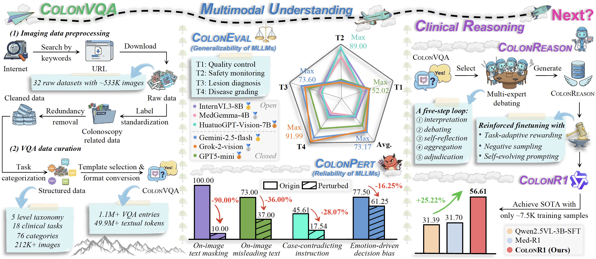

# Project COLON-X 🚀 Pushing the neXt frontier in intelligent COLONoscopy

<div align="center">
	<p align="center">
        📖 <b>[Title]</b> Colon-X: Advancing Intelligent Colonoscopy from <u>Multimodal Understanding</u> to <u>Clinical Reasoning</u> (<a href="https://arxiv.org/abs/2512.03667">🔗arXiv</a>, <a href="https://huggingface.co/papers/2512.03667">🤗Huggingface</a>, <a href="https://papers.cool/arxiv/2512.03667">📄CoolPapers</a>)
    </p>
	<p align="center">
        🤝 <b>[Project members]</b> <a href="https://scholar.google.com/citations?user=oaxKYKUAAAAJ&hl=zh-CN&oi=ao">Ge-Peng Ji</a> (🇦🇺 Australian National University), <a href="https://github.com/Jancsi9981">Jingyi Liu</a> (🇨🇳 VCIP Lab, Nankai University), <a href="https://scholar.google.com/citations?user=kakwJ5QAAAAJ&hl=zh-CN&oi=ao">Deng-Ping Fan*</a> (🇨🇳 VCIP Lab, Nankai University), and <a href="https://scholar.google.com/citations?user=yMXs1WcAAAAJ&hl=zh-CN&oi=ao">Nick Barnes</a> (🇦🇺 Australian National University)
    </p>
	<p align="center">
        🏥 <b>[Multimodal datasets]</b> ColonVQA/ColonEval/ColonPert/ColonReason (<a href="https://drive.google.com/drive/folders/1BDC3sCQkxzdks_Mh3yT9J8g2F8mv7i64?usp=sharing">🔗Google Drive</a> & <a href="https://huggingface.co/datasets/ai4colonoscopy/Colon-X">🤗Huggingface</a>) 👉 Fill out the <a href="https://forms.gle/69ia9TKXLQwnHXnY6"> 🈸google form</a> to unlock full access to our data.
    </p>
	<p align="center">
        🤖 <b>[Reasoning model]</b> The first R1-Styled thinking model, ColonR1, tailored for colonoscopy tasks  (<a href="https://drive.google.com/drive/folders/1mIo_3Lq4p15fBof75v3NSyNh75QZYCpu?usp=sharing">🔗Google Drive</a> & <a href="https://huggingface.co/ai4colonoscopy/ColonR1">🤗Huggingface</a>)
    </p>
	<p align="center">
        🔍 <b>[Keywords]</b> Multimodal Colonoscopy Analysis, Multimodal Understanding, Clinical Reasoning, Reinforcement Learning, Multimodal Benchmark, AI Healthcare, and Abdomen
    </p>
	<p align="center">
        💬 <b>[Contact]</b> Our Colon-X project is ongoing. I would love to hear your questions and suggestions: <a href="mailto:gepengai.ji@gmail.com">📧gepengai.ji@gmail.com</a>
    </p>
</div>


<p align="center">
     <br />
    <em> 
    <b>Research roadmap of our Colon-X project.</b> Building upon the most comprehensive <u>multimodal colonoscopy dataset</u> (ColonVQA), we propel a pivotal transition in intelligent colonoscopy, evolving from <u>multimodal understanding</u> (ColonEval and ColonPert) to <u>clinical reasoning</u> (ColonReason and ColonR1). These efforts collectively illuminate the path to next-generation advances in clinical colonoscopy and broader medical applications.
    </em>
</p>


## 🔥 Updates

- **[Dec/09/2025]** 🔥 Project release, including markdown guides, data access links, and an colonoscopy-specific R1-styled ColonR1 model.

## ✨ Highlights -- "What do we contribute to the community?"

> [!important]
> 📌 **TL;DR “太长不看版”** -- Colonoscopy saves lives — but AI for colonoscopy is still far from intelligent. We are excited to launch the Colon-X project, an open initiative aimed at advancing multimodal intelligence in colonoscopy and beyond. Beyond serving as a community-wide data foundation, we're focused on a critical yet underexplored transition – evolving from multimodal understanding to clinical reasoning.


### 🌟 Highlight 1 -- ColonVQA

- **Motivation:** Multimodal Data Scarcity in Colonoscopy *“巧妇难为无米之炊 -- 多模态结肠镜数据的匮乏“*
	- Currently, the field still struggles with a persistent [benchmarking crisis](https://www.nature.com/articles/s41591-025-03637-3), which stems not only from the scarcity of biomedical data, but also from the convention of task-specific models trained on isolated benchmarks. 
- **Contribution:** Building a million-scale data foundation for multimodal colonoscopy analysis *“数据基建 -- 首个专注于结肠镜领域的百万级别多模态数据”*  
	- To address this, we construct the largest multimodal colonoscopy dataset, ColonVQA, by consolidating public data sources, thus enabling task-modality synergies essential in multimodal intelligence.
    - 💡 ColonVQA is the most extensive database ever built for multimodal colonoscopy analysis, featuring 1,100,786 visual question-answering (VQA) queries, equivalent to over 49.9 million textual tokens. It is distinguished by its <b>category-rich</b> composition, containing 212,742 images across 76 clinically meaningful findings, and <b>task-diverse</b> design, covering 18 multimodal tasks organized within a five-level taxonomy.
- **Data access:** Refer to [📝markdown guide](./docs/1-how-to-download-data.md) to download and prepare our entire dataset.

### 🌟 Highlight 2 -- Multimodal Understanding

- **Motivation:** Multimodal understanding abilities are still unknown in colonoscopy *“未知之境 -- 多模态大模型在结肠镜领域到底发展到了什么地步？”*
- **Contribution:** Benchmarking generalizability and reliability of MLLMs in colonoscopy “评估多模态大模型在结肠镜领域中的可用性和可靠性”
	- 💡 **Generalizability:** *“可用性评估”* We introduce a clinically reviewed set, ColonEval, that assesses the generalizability of 22 multimodal large language models (MLLMs) across diverse colonoscopy tasks. Refer to [📝markdown guide](./docs/2-instructions-for-coloneval.md) to quickly start generalizability evaluation.
	- 💡 **Reliability:** *“可靠性评估”* We introduce ColonPert to quantify robustness against human-induced perturbations. We identified a critical "text-dominance bias", where models are easily misled by implicit on-image text or explicit textual prompts. Refer to [📝markdown guide](./docs/3-instructions-for-colonpert.md) to quickly start reliability evaluation.

### 🌟 Highlight 3 -- Clinical Reasoning

- **Motivation:** Although large reasoning models (eg., [o-series](https://openai.com/index/introducing-o3-and-o4-mini/), [DeepSeek-R1](https://www.nature.com/articles/s41586-025-09422-z)) have demonstrated impressive chain-of-thought capability in complex tasks, their potential in colonoscopy remains largely unexplored. This inspires us to advance this frontier beyond understanding toward clinical reasoning, through both data and model innovations.

- **Contribution:** Evolving multimodal understanding to clinical reasoning in intelligent colonoscopy *“进阶蜕变 -- 让结肠镜多模态大模型从理解能力进化为推理能力”*
	- 💡 **ColonReason:** *“使用多专家辩论框架构建推理链条”* A clinically grounded reasoning dataset annotated through a multi-expert debating pipeline. It simulates a clinical peer discussion loop (interpretation, debating, self-reflection) to generate structured reasoning traces. Refer to [📝markdown guide](./docs/4-instructions-for-colonreason.md) to access the curated reasoning dataset.
	- 💡 **ColonR1:** *“不仅要会决策，还要知道背后的原因”* The first R1-styled model tailored for colonoscopy, incorporating task-adaptive rewarding to accommodate diverse tasks. It employs self-evolving prompting to learn from past errors, achieving SOTA performance with only ~7.5K training samples. We provide a quick demo below to help you get started. More details can be found in [📝markdown guide](./docs/5-instructions-for-colonr1.md).


## 🛠️ Quick Start of Our Reasoning Model (ColonR1)

Below is a code snippet to help you quickly try out our ColonR1 model using [🤗Huggingface Transformers](https://huggingface.co/docs/transformers/en/index). For convenience, we manually combined some configuration and code files. Please note that this is a quick inference code, we recommend you using our full code to explore more.

- Before running the snippet, you need to install the following minimum dependencies.

	```shell
	conda create -n quickstart python=3.10
	conda activate quickstart
	pip install torch transformers accelerate pillow
	```

- Then you can use `python ColonR1/quickstart.py` to run it, as shown in the following code.

	```python
	import torch
	from transformers import AutoProcessor, Qwen2_5_VLForConditionalGeneration
	from PIL import Image
	import warnings
	import os

	warnings.filterwarnings('ignore')
	device = "cuda" if torch.cuda.is_available() else "cpu"

	MODEL_PATH = "ai4colonoscopy/ColonR1"
	IMAGE_PATH = "assets/example.jpg"
	Question = "Does the image contain a polyp? Answer me with Yes or No."

	print(f"[Info] Loading model from {MODEL_PATH}...")
	model = Qwen2_5_VLForConditionalGeneration.from_pretrained(
		MODEL_PATH,
		torch_dtype=torch.bfloat16,
		attn_implementation="flash_attention_2",
		device_map="auto"
	)
	model.eval()

	processor = AutoProcessor.from_pretrained(MODEL_PATH)

	if not os.path.exists(IMAGE_PATH):
		raise FileNotFoundError(f"Image not found at {IMAGE_PATH}. Please provide a valid image path.")

	image = Image.open(IMAGE_PATH).convert("RGB")

	TASK_SUFFIX = (
		"Your task: 1. First, Think through the question step by step, enclose your reasoning process "
		"in <think>...</think> tags. 2. Then provide the correct answer inside <answer>...</answer> tags. "
		"3. No extra information or text outside of these tags."
	)

	final_question = f"{Question}\n{TASK_SUFFIX}"

	messages = [
		{
			"role": "user",
			"content": [
				{"type": "image", "image": IMAGE_PATH},
				{"type": "text", "text": final_question},
			],
		}
	]

	print("[Info] Processing inputs...")
	text_prompt = processor.apply_chat_template(messages, tokenize=False, add_generation_prompt=True)

	inputs = processor(
		text=[text_prompt],
		images=[image],
		padding=True,
		return_tensors="pt",
	).to(device)


	print("[Info] Generating response...")
	with torch.no_grad():
		generated_ids = model.generate(
			**inputs,
			max_new_tokens=1024,
			do_sample=False
		)

	generated_ids_trimmed = generated_ids[:, inputs.input_ids.shape[1]:]
	output_text = processor.batch_decode(generated_ids_trimmed, skip_special_tokens=True)[0]

	print(output_text)
	```


## 🚨 Ethical and Responsible Use

ColonR1 is designed to assist in medical colonoscopy by leveraging multimodal reasoning capabilities, but it comes with no guarantees regarding its predictive accuracy or reliability in clinical practice. Users should be aware that the datasets and pre-trained models used in ColonR1 may contain inherent biases, including socioeconomic factors, which can lead to misclassification or other undesirable behaviors, such as the generation of offensive or inappropriate content.

We urge users and developers to carefully review and validate the performance of pre-trained models, particularly those integrated through the ColonR1 framework, before considering practical applications in a clinical setting. It is crucial that any AI-driven tool used in healthcare undergoes rigorous testing to ensure patient safety and avoid unintended consequences. Our commitment to ethical AI use extends to ongoing efforts to investigate, address, and mitigate the risks of bias and inappropriate behavior in ColonR1. Continuous improvement of this codebase is a priority to ensure that the system aligns with responsible and equitable healthcare standards.


## 📚 Reference

Feel free to cite if you find the **Colon-X Project** useful for your work:

	@article{ji2025colonx,
	  title={Colon-X: Advancing Intelligent Colonoscopy from Multimodal Understanding to Clinical Reasoning},
	  author={Ji, Ge-Peng and Liu, Jingyi and Fan, Deng-Ping and Barnes, Nick},
	  journal={arXiv preprint arXiv:2512.03667},
	  year={2025}
	}

 We recommend reading the following concurrent works related to "intelligent colonoscopy" from our team:

- Survey Paper on Intelligent Colonoscopy
	- 🔥🔥🔥 **ColonSurvey**: paper link (https://arxiv.org/abs/2410.17241) & project link (https://github.com/ai4colonoscopy/IntelliScope?tab=readme-ov-file#-colonsurvey)
- Visual analysis
	- Image polyp segmentation
		- 🔥🔥 **PraNet**: paper link (https://link.springer.com/chapter/10.1007/978-3-030-59725-2_26) & project link (https://github.com/DengPingFan/PraNet)
		- PraNet-v2: paper link (https://ieeexplore.ieee.org/document/10082016) & project link (https://github.com/ai4colonoscopy/PraNet-V2)
	- Video polyp segmentation: 
		- PNS-Net: paper link (https://arxiv.org/abs/2105.08468) & project link (https://github.com/GewelsJI/PNS-Net)
		- 🔥🔥 **SUN-SEG** & PNS++: paper link (https://arxiv.org/abs/2203.14291) & project link (https://github.com/GewelsJI/VPS)
- Multimodal analysis
  -  Multimodal understanding: paper link (https://arxiv.org/abs/2410.17241) & project link (https://github.com/ai4colonoscopy/IntelliScope)
		- ColonINST: 500K+ VQA entries for instruction tuning dataset
		- 🔥🔥 **ColonGPT**: the first multimodal large language model in colonoscopy
  - 🔥🔥 Multimodal reasoning: ColonReason & **ColonR1** (This work!)

## 🧩 Collaborating towards the neXt frontier

We are actively looking for potential collaborators to help push this community forward — especially hospitals or medical institutions that can **provide diverse, real-world clinical colonoscopy data** (eg., data across different devices, modalities, patient populations, and clinical workflows). If you’re interested in contributing or partnering with us, we’d be very happy to connect. 

We’re still on the journey toward building truly intelligent colonoscopy systems, and this project is very much under active development. We warmly welcome any feedback, ideas, or suggestions that can help shape its future. 

For any inquiries or thoughts you’d like to share, feel free to reach out to us at 📧 gepengai.ji@gmail.com & 📧 jingyi.liu2657@gmail.com


## 🙏 Acknowledgements

We gratefully acknowledge the contributions of the following projects, which served as the foundation and inspiration for our work: 

+ [📦 Qwen2.5-VL](https://github.com/QwenLM/Qwen2.5-VL): The most powerful vision-language model in the Qwen series to date.
+ [📦 R1-V](https://github.com/StarsfieldAI/R1-V): Reinforcing Super Generalization Ability in Vision Language Models with Less Than $3.
+ [📦 open-r1](https://github.com/huggingface/open-r1): A fully open reproduction of DeepSeek-R1. 

Moreover, special thanks to the public datasets, as their contributions made it possible to build such such the largest-scale benchmark. These datasets include: [🗂️CAD-CAP](https://pmc.ncbi.nlm.nih.gov/articles/PMC7035135/), [🗂️CVC-ClinicDB](https://polyp.grand-challenge.org/CVCClinicDB/), [🗂️CVC-ColonDB](http://vi.cvc.uab.es/colon-qa/cvccolondb/), [🗂️EDD2020](https://edd2020.grand-challenge.org/), [🗂️ETIS-Larib](https://polyp.grand-challenge.org/ETISLarib/), [🗂️PICCOLO](https://www.biobancovasco.org/en/Sample-and-data-catalog/Databases/PD178-PICCOLO-EN.html), [🗂️PolypGen](https://www.synapse.org/Synapse:syn26376615/wiki/613312), [🗂️PS-NBI2K](https://github.com/JaeZ1205/PS_NBI2k), [🗂️Kvasir](https://datasets.simula.no/kvasir/), [🗂️Hyper-Kvasir](https://datasets.simula.no/hyper-kvasir/), [🗂️ASEI](https://endoscopy.selab.hcmus.edu.vn/), [🗂️Kvasir-Capsule](https://osf.io/dv2ag/), [🗂️GastroVision](https://osf.io/84e7f/), [🗂️SUN-SEG](https://github.com/GewelsJI/VPS), [🗂️WCEBleedGen](https://zenodo.org/records/10156571), [🗂️Capsule Vision 2024](https://github.com/UTSAVS26/Capsule-Vision-2024-Challenge), [🗂️KID1](https://mdss.uth.gr/datasets/endoscopy/kid/), [🗂️KID2](https://mdss.uth.gr/datasets/endoscopy/kid/), [🗂️in vivo](http://hamlyn.doc.ic.ac.uk/vision/), [🗂️KUMC](https://dataverse.harvard.edu/dataset.xhtml?persistentId=doi:10.7910/DVN/FCBUOR), [🗂️CP-CHILD](https://figshare.com/articles/dataset/CP-CHILD_zip/12554042), [🗂️LIMUC](https://zenodo.org/records/5827695#.ZF-92OzMJqs), [🗂️SSL-CPCD](https://www.synapse.org/Synapse:syn52674005/files/), [🗂️MedFMC](https://doi.org/10.6084/m9.figshare.c.6476047.v1), [🗂️WCE Colon Disease](https://www.kaggle.com/datasets/francismon/curated-colon-dataset-for-deep-learning), [🗂️CPC-Paired](https://github.com/qinwang-ai/PolypsAlign), [🗂️ColonoscopicDS](http://www.depeca.uah.es/colonoscopy_dataset/), [🗂️PolypDB](https://github.com/DebeshJha/PolypDB), [🗂️Kvasir-Instrument](https://datasets.simula.no/kvasir-instrument/), [🗂️LDPolyVideo](https://github.com/dashishi/LDPolypVideo-Benchmark), [🗂️Endo4IE](https://data.mendeley.com/datasets/3j3tmghw33/1), and [🗂️Nerthus](https://www.kaggle.com/datasets/waltervanhuissteden/the-nerthus-dataset).
