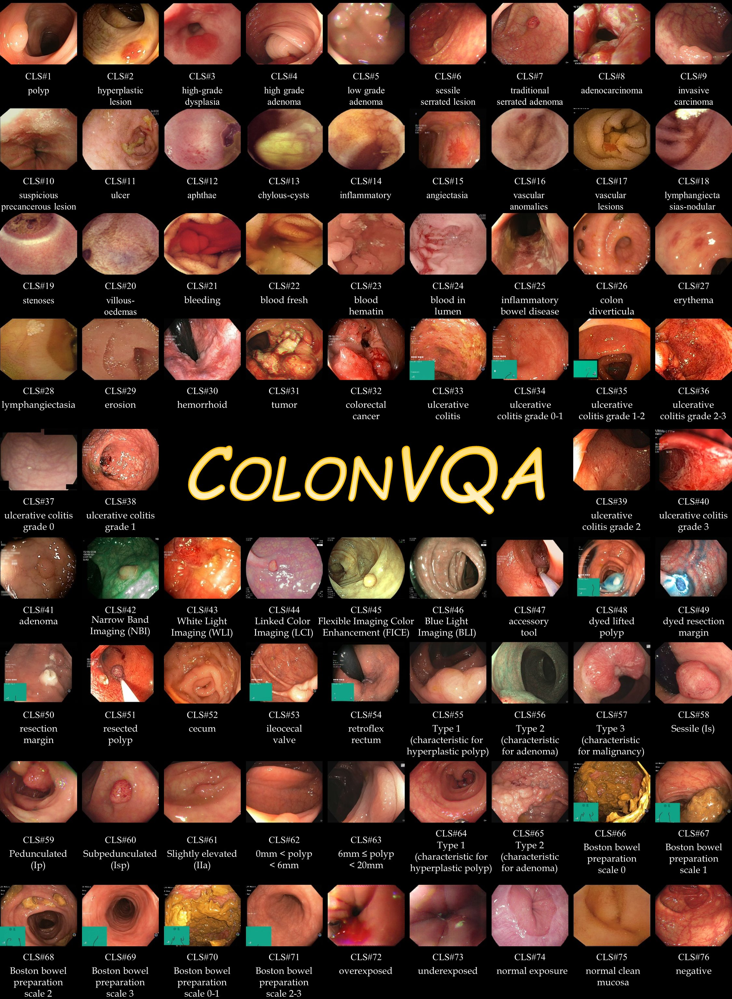
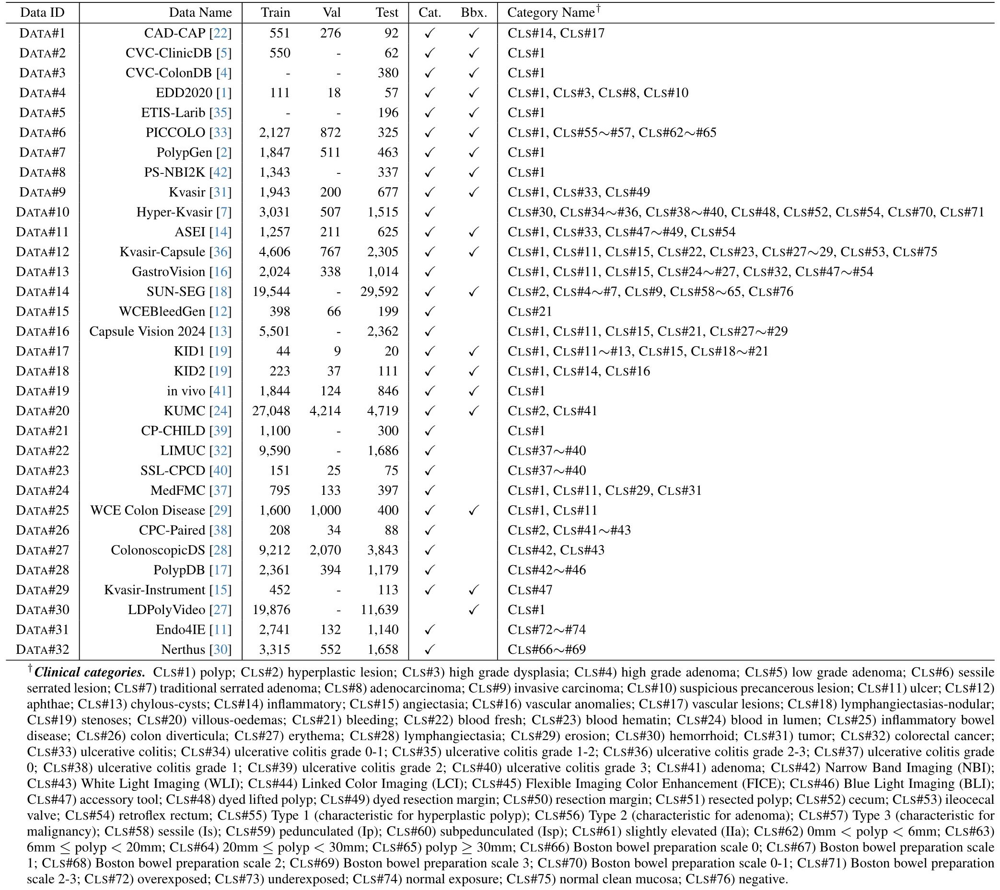
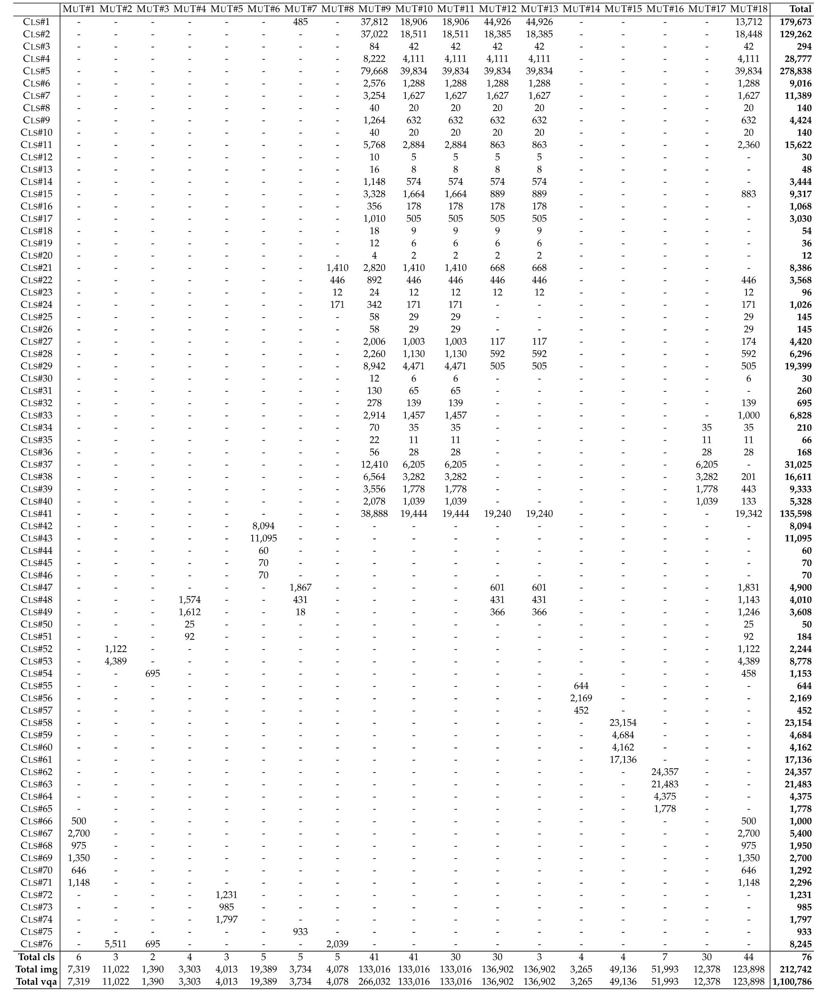

# How to Download and Prepare Our Dataset


<p align="center">
     <br />
    <em> 
    Figure 1: Visualization of 76 clinical categories from our dataset.
    </em>
</p>


## 1. Data Overview of Our Colon-X Project

> [!important]
> 📌 **Revisiting.**
> Building upon the most comprehensive multimodal colonoscopy database ColonVQA, we propel a pivotal transition in intelligent colonoscopy, evolving from multimodal understanding (ColonEval & ColonPert) to clinical reasoning (ColonReason & ColonR1). These efforts collectively illuminate the path to neXt-generation advances in clinical COLONoscopy and broader medical applications.

On this page, we are about to provide a step-by-step guide on how to download and prepare these four data parts -- including ColonVQA, ColonEval, ColonPert, and ColonReason -- for all experiments presented in our research paper.


### 1.1. Data access

We first introduce ColonVQA, the main multimodal dataset in our Colon-X project. The colonoscopy images were sourced from 32 public datasets, and due to strict licensing, we cannot share the datasets or download links with you directly. Here are the steps to obtain the complete dataset:

- **Requesting access to raw images.** 
We recommend requesting the images from the providers of these datasets first. Please follow the official links below to request access to the 32 public data origins. 

  | Data ID | Data Name | Train | Val | Test | URL |
  | :--- | :--- | :---: | :---: | :---: | :--- |
  | Data #1 | CAD-CAP | 551 | 276 | 92 | request by email |
  | Data #2 | CVC-ClinicDB | 550 | - | 62 | [Link](https://polyp.grand-challenge.org/CVCClinicDB/) |
  | Data #3 | CVC-ColonDB | - | - | 380 | [Link](http://vi.cvc.uab.es/colon-qa/cvccolondb/) |
  | Data #4 | EDD2020 | 111 | 18 | 57 | [Link](https://edd2020.grand-challenge.org/) |
  | Data #5 | ETIS-Larib | - | - | 196 | [Link](https://polyp.grand-challenge.org/ETISLarib/) |
  | Data #6 | PICCOLO | 2,127 | 872 | 325 | [Link](https://www.biobancovasco.org/en/Sample-and-data-catalog/Databases/PD178-PICCOLO-EN.html) |
  | Data #7 | PolypGen | 1,847 | 511 | 463 | [Link](https://www.synapse.org/Synapse:syn26376615/wiki/613312) |
  | Data #8 | PS-NBI2K | 1,343 | - | 337 | [Link](https://github.com/JaeZ1205/PS_NBI2k) |
  | Data #9 | Kvasir | 1,943 | 200 | 677 | [Link](https://datasets.simula.no/kvasir/) |
  | Data #10 | Hyper-Kvasir | 3,031 | 507 | 1,515 | [Link](https://datasets.simula.no/hyper-kvasir/) |
  | Data #11 | ASEI | 1,257 | 211 | 625 | [Link](https://endoscopy.selab.hcmus.edu.vn/) |
  | Data #12 | Kvasir-Capsule | 4,606 | 767 | 2,305 | [Link](https://osf.io/dv2ag/) |
  | Data #13 | GastroVision | 2,024 | 338 | 1,014 | [Link](https://osf.io/84e7f/) |
  | Data #14 | SUN-SEG | 19,544 | - | 29,592 | [Link](https://github.com/GewelsJI/VPS) |
  | Data #15 | WCEBleedGen | 398 | 66 | 199 | [Link](https://zenodo.org/records/10156571) |
  | Data #16 | Capsule Vision 2024 | 5,501 | - | 2,362 | [Link](https://github.com/UTSAVS26/Capsule-Vision-2024-Challenge) |
  | Data #17 | KID1 | 44 | 9 | 20 | [Link](https://mdss.uth.gr/datasets/endoscopy/kid/) |
  | Data #18 | KID2 | 223 | 37 | 111 | [Link](https://mdss.uth.gr/datasets/endoscopy/kid/) |
  | Data #19 | in vivo | 1,844 | 124 | 846 | [Link](http://hamlyn.doc.ic.ac.uk/vision/) |
  | Data #20 | KUMC | 27,048 | 4,214 | 4,719 | [Link](https://dataverse.harvard.edu/dataset.xhtml?persistentId=doi:10.7910/DVN/FCBUOR) |
  | Data #21 | CP-CHILD | 1,100 | - | 300 | [Link](https://figshare.com/articles/dataset/CP-CHILD_zip/12554042) |
  | Data #22 | LIMUC | 9,590 | - | 1,686 | [Link](https://zenodo.org/records/5827695#.ZF-92OzMJqs) |
  | Data #23 | SSL-CPCD | 151 | 25 | 75 | [Link](https://www.synapse.org/Synapse:syn52674005/files/) |
  | Data #24 | MedFMC | 795 | 133 | 397 | [Link](https://doi.org/10.6084/m9.figshare.c.6476047.v1) |
  | Data #25 | WCE Colon Disease | 1,600 | 1,000 | 400 | [Link](https://www.kaggle.com/datasets/francismon/curated-colon-dataset-for-deep-learning) |
  | Data #26 | CPC-Paired | 208 | 34 | 88 | [Link](https://github.com/qinwang-ai/PolypsAlign) |
  | Data #27 | ColonoscopicDS | 9,212 | 2,070 | 3,843 | [Link](http://www.depeca.uah.es/colonoscopy_dataset/) |
  | Data #28 | PolypDB | 2,361 | 394 | 1,179 | [Link](https://github.com/DebeshJha/PolypDB) |
  | Data #29 | Kvasir-Instrument | 452 | - | 113 | [Link](https://datasets.simula.no/kvasir-instrument/) |
  | Data #30 | LDPolyVideo | 19,876 | - | 11,639 | [Link](https://github.com/dashishi/LDPolypVideo-Benchmark) |
  | Data #31 | Endo4IE | 2,741 | 132 | 1,140 | [Link](https://data.mendeley.com/datasets/3j3tmghw33/1) |
  | Data #32 | Nerthus | 3,315 | 552 | 1,658 | [Link](https://www.kaggle.com/datasets/waltervanhuissteden/the-nerthus-dataset) |

- **Accessing our JSON files.** Once you have successfully requested and downloaded the original images, you can download the VQA JSON files provided in our project, which contains four data parts: ColonVQA/ColonEval/ColonPert/ColonReason (Coming soon ...).

- **Reorganize file structure.** If you downloaded the images from a public link, their folder layout may differ from the one used in our project. Please use the paths specified in the JSON files as a guide and arrange the images accordingly so that your directory structure aligns with what the Colon-X project expects.

- **⭐️Recommended -- Too much hassle for you?** We also provide a fully organized version of the dataset. If you prefer not to restructure the files yourself, you can request access by filling out [🈸 google form](https://forms.gle/s7rtTejt3ScvHczu8) to request. If you have any questions during the data application process, feel free to contact us at 📧 gepengai.ji@gmail.com & 📧 jingyi.liu2657@gmail.com.

### 1.2 Directory Structure of Four Data Parts

At this point, we assume you’ve already got the full data resources, which contain four parts: 

- **ColonVQA (main part)**: The main multimodal dataset, containing 1.1M+ visual question answering pairs across 76 clinical findings and 18 task types. Designed for instruction tuning and benchmarking multimodal tasks in colonoscopy.
- **ColonEval**: A dedicated evaluation suite with curated test sets covering diverse clinical tasks. Built to assess the generalization of MLLMs in real clinical scenarios.
- **ColonPert**: A perturbation-based dataset consisting of origin–perturbation image pairs. Used to evaluate how reliably MLLMs handle human-induced perturbations.
- **ColonReason**: A reasoning-focused dataset that provides step-by-step or chain-of-thought style annotations, enabling the study and training of explicit reasoning capabilities for colonoscopy decision-making.

As shown below, your final directory structure should look something like this: 

```text
📁 cache/
└── 📁 data/
    ├── 📁 JSON/                                   # all annotation *.json files
    │   ├── 📁 ColonVQA/                           # main multimodal dataset (1.1M+ VQA entries)
    │   │   ├── 📁 train/                          # training split with task-specific JSON files
    │   │   │   ├── 1_Grading_of_Bowel_Cleanliness_Train.json
    │   │   │   └── ...
    │   │   ├── 📁 val/                            # validation split
    │   │   │   └── ...
    │   │   └── 📁 test/                           # testing split
    │   │       └── ...
    │   ├── 📁 ColonEval/                          # evaluation JSONs for benchmarking MLLM generalizability
    │   ├── 📁 ColonPert/                          # origin–perturbation pairs for robustness evaluation
    │   └── 📁 ColonReason/                        # reasoning-style annotations (step-by-step / chain-of-thought)
    │
    ├── 📁 Positive-images/                        # images with positive clinical findings
    │   └── 📁 ASEI/
    │       ├── 📁 Train/
    │       │   └── 📁 polyp/
    │       │       ├── 2.jpg
    │       │       └── ...
    │       ├── 📁 Val/
    │       │   └── ...
    │       └── 📁 Test/
    │           └── ...
    │
    ├── 📁 Negative-images/                        # images without pathological findings
    │   └── ...
    │
    ├── 📁 Misleading-text-images/                 # perturbed images with misleading text (used in ColonPert)
    │   └── ...
    │
    └── 📁 Text-mask-images/                       # text-masked versions (used in ColonPert)
        └── ...
```

## 2. ColonVQA

Here, we will introduce the general formats in our main multimodal dataset, ColonVQA. As for other derived sub-datasets, please refer to specific documents stored in `./docs/*`.

### 2.1. Illustration of Data Format

> [!important]
> 📌 **Note.** 
> Our data format is compatible with most MLLM training frameworks that support conversational-style datasets. This modular design also makes it easy to extend -- whether by adding new tasks, introducing new annotation types, or incorporating additional imaging modalities in the future.

- All JSON annotation files share a unified structure across all colonoscopy-related tasks (including diagnosis, quality assessment, detection, report generation, etc.). This unified design enables vision–language interaction and simplifies data loading for different tasks.
    - For complete task definitions, please refer to [🔗task_card.pdf](./task_card.pdf) or inspect the JSON files directly.
- Field Descriptions
    - `"id"`: Relative path pointing to the associated image. Commonly used by dataloaders to locate the visual input.
    - `"image"`: Typically identical to `id`, as a backup.
    - `"conversations"`: An ordered list representing a multi-turn dialogue. Each element includes:
        - `"from"`: Indicates the speaker role, either "human" (prompt) or "gpt" (response).
        - `"value"`: Text content of that turn. `"human"` turns always start with "<image>", denoting that the visual input is provided to the model. Questions are randomly selected from predefined templates corresponding to different tasks. And `"gpt"` represents the reference.

        ```json
        {
            "id": "relative/path/to/an/image",
            "image": "relative/path/to/an/image",
            "conversations": [
                {
                    "from": "human",
                    "value": "<image>\nA randomly selected question from 5 templates"
                },
                {
                    "from": "gpt",
                    "value": "The answer"
                }
            ]
        }
        ```


### 2.2. Data statistics

- **Data-Category Table:** We detail the index number (DATA#) of each dataset, the counts of images in the training-validation-test splits, and the types of annotations: category tags (Cat.) and bounding boxes (Bbx.). Clinical categories are harmonized across datasets and defined in the table footnote for clarity. 

<p align="center">
     <br />
    <em> 
    Table 2: Overview of colonoscopy imaging data included in COLONVQA.
    </em>
</p>


- **Category-Task Table:** We report the count of VQA pairs for 76 categories and 18 tasks in our ColonVQA. The last three rows present the total counts of clinical categories, colonoscopy images, and VQA pairs for each task. The full names corresponding to each category abbreviation are provided in the footnote of Table 1.

<p align="center">
     <br />
    <em> 
    Table 3: Overview of category-task statistics in ColonVQA.
    </em>
</p>