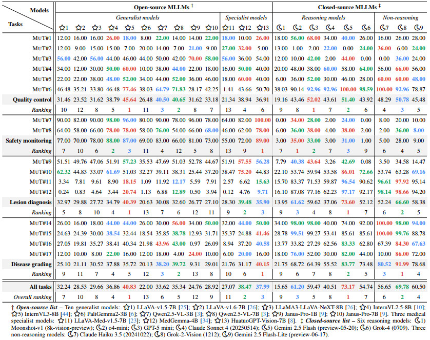

# ColonEval: Evaluating multimodal understanding behaviours of MLLM

> 📢 To facilitate rapid evaluation on leading multimodal large language models (MLLMs), we derived a subset, ColonEval, from the test set of ColonVQA. This subset encompasses 4,568 VQA entries across 16 distinct tasks, covering a wide range of clinical scenarios in colonoscopy. ColonEval is designed to assess the generalization capabilities of MLLMs in the context of colonoscopy.


## 1. Get Started with Inferring MLLMs on ColonEval

> [!IMPORTANT]
> 📢 **Recommended!** 
> Feel free to skip this inference step -- because we've already done all the heavy lifting for you! Please check out [📝here](#3-benchmarking-results) to obtain all prediction results and their evaluation scores reported in our article.


To evaluate an MLLM using ColonEval, please first follow the inference instructions provided by the official repository of each respective MLLMs. Here, we provide two example demos, an [📝open-source](#11-an-open-source-demo) and a [📝closed-source](#12-a-closed-source-demo) model, to illustrate the workflow. 


Before running any MLLMs, please download the ColonEval dataset and organize it as follows:

```text
📁 cache/
└── 📁 data/
    ├── 📁 JSON/                                   # all annotation *.json files
        ├── 📁 ColonEval/                          # evaluation JSONs for benchmarking MLLM generalizability
            ├── Task1_predict_by_your_model.json   # testing split with task-specific JSON files
            └── ...
```

Then create and activate a conda environment. Our default setup uses CUDA 11.8. Notably, we did not test other versions and cannot guarantee compatibility.

```shell
conda create -n coloneval python=3.10 -y
conda activate coloneval

pip install torch==2.5.1 torchvision==0.20.1 torchaudio==2.5.1 --index-url https://download.pytorch.org/whl/cu118
pip install -r ColonEval/requirements.txt
```

### 1.1. An open-source demo

We provide a MedGemma inference example to demonstrate how we perform this process. If you require other open-source models, please follow their respective inference protocols.

- Firstly, download the MedGemma-4B checkpoints from [🤗HuggingFace](https://huggingface.co/google/medgemma-4b-it) and place them in the `cache/exp/ColonEval` path.
- Secondly, set `EXP_MODEL_ID` to the path of your model checkpoints, such as `cache/exp/ColonEval/medgemma-4b-it`.
- Then set `IMAGE_BASE_PATH` and `ROOT_PATH` to the root directories of the images and JSON files, respectively.
- Next, please configure the environment according to [🔗MedGemma's instructions](https://github.com/google-health/medgemma).
- Finally, just run `bash ColonEval/infer_open_source_demo.sh` to start inference.


### 1.2. A closed-source demo

We provide a o4-mini infer example to demonstrate how we perform this process. If you require other open-source models, please follow their respective inference protocols.

- Firstly, please purchase the API quota from the model provider, for example, [🔗o4-mini](https://platform.openai.com/docs/quickstart).
- Secondly, set `MODEL` as the model name. Use the officially published name, such as `o4-mini-2025-04-16`.
- Then set `IMAGE_BASE_PATH` and `ROOT_PATH` to the root directories of the images and JSON files, respectively.
- Finally, just run `bash ColonEval/infer_closed_source_demo.sh` to start inference.


## 2. One-command Evaluation Code

If you are using ColonEval to test the generalization ability of MLLM, you only need to modify a few configurations in `ColonEval/eval_generalizability.sh` to execute it.

- If you performed the inference as described above, the prediction files should already be in the `cache/exp/ColonEval/Model_Name/pred` path. 
  - **[Recommend!]** You can directly download all predictions from [🔗Google Drive](https://drive.google.com/drive/folders/1qHYVq0pr-THvlvF4Eszqj92Ahw2CP_Tg?usp=sharing). 
- Place the prediction file you need to eval in the `cache/exp/ColonEval/Model_Name` path. 
- Set `EXP_MODEL_ID` to the path of the model you want to eval. See [📝here](#3-benchmarking-results) for information on the models we evaluated.
- Now just use `bash ColonEval/eval_generalizability.sh` to start the evaluation. 
- When the process finishes, the evaluation results will be displayed here: `$EXP_MODEL_ID/pred/`.
- An evaluation example is as follows:

    ```shell
    #!/bin/bash

    export CUDA_VISIBLE_DEVICES=0,1,2,3,4,5,6,7

    EXP_MODEL_ID=cache/exp/ColonEval/medgemma-4b-it
    EVAL_MODE=pilot

    python ColonEval/eval_engine.py \
        --task_id 1 \
        --eval_mode $EVAL_MODE \
        --input_file $EXP_MODEL_ID/pred/pred_Task_1_ColonEval.json \
        --output_file $EXP_MODEL_ID/pred/Task_1.txt > $EXP_MODEL_ID/pred/eval_task_1_log.txt 2>&1
    ```

## 3. Benchmarking Results

The below is the generalizability of 22 MLLMs across four task categories and their integration within ColonEval. Accuracy is computed using a weighted arithmetic mean, with weights proportional to the sample count of each task category. The top three scores of both open and closed-source camps are highlighted using distinct colors (1st, 2nd, 3rd). Prediction results for each model on each task are available on [🔗Google Drive](https://drive.google.com/drive/folders/1qHYVq0pr-THvlvF4Eszqj92Ahw2CP_Tg?usp=sharing).

<p align="center">
     <br />
    <em> 
    Table 1:  Generalizability of 22 multimodal large language models (MLLMs) on ColonEval.
    </em>
</p>


## 4. Data statistics

Here we present the ColonEval statistics, including the categories and VQA entries for each task.

| Task | Category | VQA entries |
| :--- | :--- | :--- |
| 1 Grading of Bowel Cleanliness | 6 | 50 |
| 2 Colonoscopy Completion Landmark Identification | 3 | 50 |
| 3 Rectum Retroflexion Identification | 2 | 50 |
| 4 Operative Status Recognition | 4 | 50 |
| 5 Imaging quality assessment | 3 | 50 |
| 6 Imaging Modality Classification | 5 | 71 |
| 7 Instrument Recognition | 5 | 50 |
| 8 Bleeding Warning | 5 | 50 |
| 9 Lesion diagnosis yes or no mode | 41 | 1258 |
| 10 Lesion diagnosis single choice mode | 41 | 629 |
| 11 Lesion diagnosis open vocabulary mode | 41 | 629 |
| 12 Referring Expression Generation | 30 | 707 |
| 14 NICE Criteria | 3 | 50 |
| 15 PARIS Criteria | 4 | 411 |
| 16 Polyp Sizing | 4 | 414 |
| 17 Grading of Ulcerative Colitis | 7 | 50 |
| **Total** | **76** | **4568** |


## 5. Use ColonEval to evaluate your own model

> [!NOTE]
> 💡 Finally, we warmly welcome everyone to participate in the evaluation. If needed, you can also send us your results in a package so we can conduct the evaluation. Please contact us via email: 📧 gepengai.ji@gmail.com.

If you want to use ColonEval to evaluate your own model, please follow these steps.

- Firstly, organize your prediction file structure as follows.
   
    ```text
    📁 cache/
    └── 📁 data/
        ├── 📁 JSON/                                   # all annotation *.json files
            ├── 📁 ColonEval/                          # evaluation JSONs for benchmarking MLLM generalizability
                ├── Task1_predict_by_your_model.json   # testing split with task-specific JSON files
                └── ...
    ```

- Secondly,  standardize the format of your prediction files as follows, 
  - "id": Relative path pointing to the associated image. Commonly used by dataloaders to locate the visual input.
  - "image": Typically identical to id, as a backup.
  - "conversations": An ordered list representing a multi-turn dialogue. Each element includes: 
    - `"from"`: Indicates the speaker role, either "human" (prompt), "gpt" (response) or "prediction" (prediction).
    - `"value"`: Text content of that turn. `"human"` represents the question or instruction, `"gpt"` represents the reference, and `"prediction"` represents the model's prediction.

    ```json
        {
            "id": "relative/path/to/an/image",
            "image": "relative/path/to/an/image",
            "conversations": [
                {
                    "from": "human",
                    "value": "question/instruction"
                },
                {
                    "from": "gpt",
                    "value": "reference"
                },
                {
                    "from": "prediction",
                    "value": "your model prediction"
                }
            ]
        }
        ......(more entries)
    ```