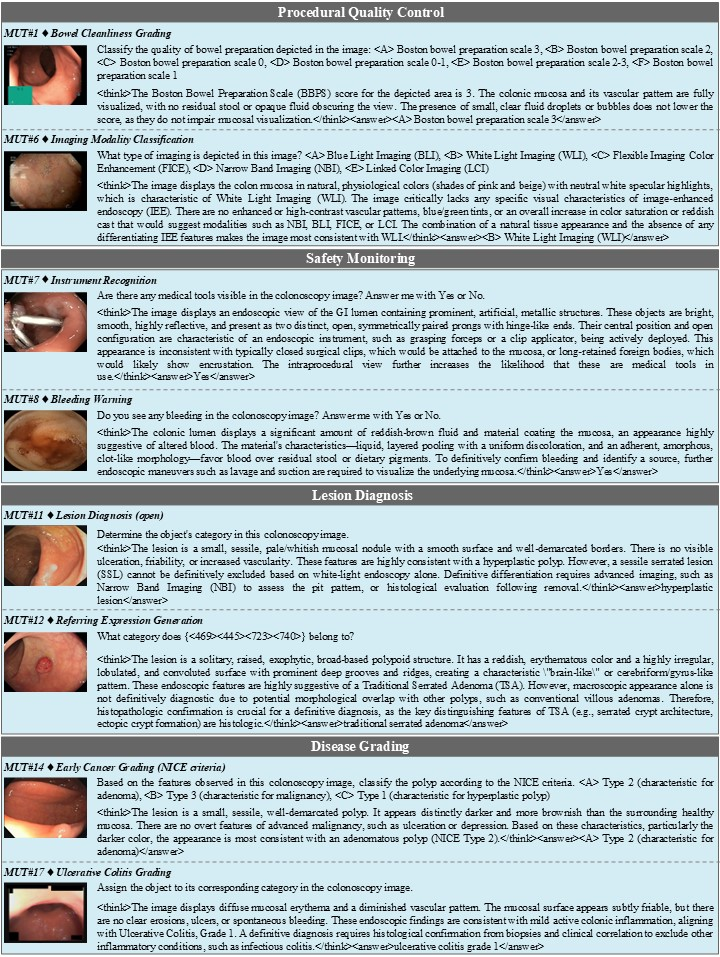

# ColonReason: A Multimodal Reasoning Dataset Designed for Colonoscopy

> 📢 We randomly sampled ∼1.5% of train–val VQA entries from the ColonVQA, and using the proposed pipeline, generated 7,484 reasoning-based VQA quadruples across 16 multimodal tasks, with outputs formatted as `<think>...</think><answer>...</answer>`. This enables the reinforced fine-tuning with reasoning supervision. 

## 1. Data Format

We provide two JSON formats compatible with different codebases, ie., Qwen and ColonR1.
Notably, they both contain identical VQA content, differing only in structure.
You can download them here:
- [🔗Qwen format](https://drive.google.com/file/d/1k2dXd-b4nrMJi3Y3gjgusVcGLM4iRmwP/view?usp=sharing)
- [🔗ColonR1 format](https://drive.google.com/file/d/1_KqP3orikoIoRgXGqg4myVo3q0fweDMm/view?usp=sharing)

### 1.1. Qwen format Field Description:

- `id`: Relative path pointing to the associated image. Commonly used by dataloaders to locate the visual input.
- `image`: Typically identical to `id`, as a backup. 
- `conversations`: An ordered list representing a multi-turn dialogue. Each element includes:
- `from`: Indicates the speaker role, either "human" (prompt) or "gpt" (response).
- `value`: Text content of that turn. 
    - `human` represents the question or instruction, 
    - `gpt` represents the reasoning trace within the <think></think>tag, and the reference within the <answer></answer> tag.

    ```json
    {
        "id": "relative/path/to/an/image",
        "image": "relative/path/to/an/image",
        "conversations": [
            {
                "from": "human",
                "value": "<image>\nquestion or instruction"
            },
            {
                "from": "gpt",
                "value": "<think>thought process</think><answer>reference</answer>"
            }
        ]
    }
    ......(more entries)
    ```

### 1.2. ColonR1 format -- Field Description:

- `image`: Relative path pointing to the associated image. Commonly used by dataloaders to locate the visual input.
- `problem`: represents the question or instruction, 
- `solution`: represents the reasoning trace and the final answer.

    ```json
    {
        "image": "relative/path/to/an/image",
        "problem": "question or instruction",
        "solution": "<think>thought process</think><answer>reference</answer>"
    },
    ......(more entries)
    ```

## 2. Data Statistics

The tables below summarize the number of sampled train and validation entries for each task in ColonReason.

| Task | Train | Val | Total |
| :--- | :--- | :--- | :--- |
| Grading of Bowel Cleanliness | 61 | 10 | 71 |
| Colonoscopy Completion Landmark Identification | 92 | 15 | 107 |
| Rectum Retroflexion Identification | 40 | 10 | 50 |
| Operative Status Recognition | 40 | 10 | 50 |
| Imaging quality assessment | 40 | 10 | 50 |
| Imaging Modality Classification | 164 | 35 | 199 |
| Instrument Recognition | 40 | 10 | 50 |
| Bleeding Warning | 40 | 10 | 50 |
| Lesion diagnosis yes or no mode | 2220 | 219 | 2439 |
| Lesion diagnosis single choice mode | 1110 | 110 | 1220 |
| Lesion diagnosis open vocabulary mode | 1110 | 110 | 1220 |
| Referring Expression Generation | 1106 | 89 | 1195 |
| NICE Criteria | 40 | 10 | 50 |
| PARIS Criteria | 272 | 0 | 272 |
| Polyp Sizing | 299 | 10 | 309 |
| Grading of Ulcerative Colitis | 142 | 10 | 152 |
| **Total** | **6816** | **668** | **7484** |


## 3. Example Display

As shown in Figure 1, we visualize representative samples by selecting two sub-tasks from each of the four major clinical categories. The visualizations illustrate how we organize reasoning traces within the `<think>...</think>` tags, as well as the final diagnostic answer in the `<answer>...</answer>` tags.

<p align="center">
     <br />
    <em> 
    Figure 1: Representative samples from ColonReason.
    </em>
</p>

