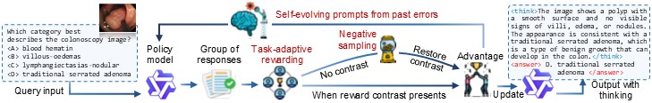
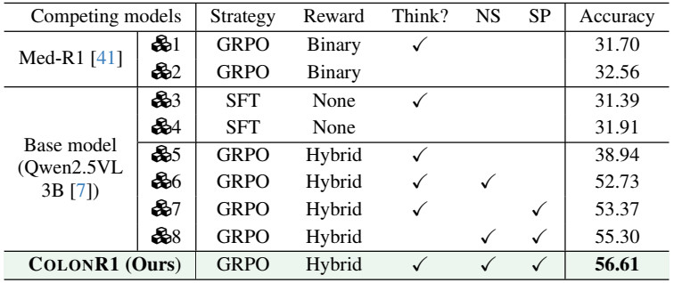
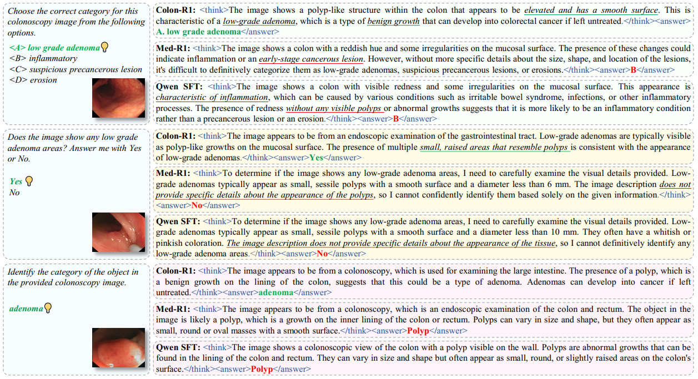

# How to train, infer, and evaluate ColonR1

<p align="center">
     <br />
    <em> 
    Figure 1: Details of our colonoscopy-specific reasoning model, ColonR1.
    </em>
</p>


## 🏁 Installation guide

> [!important]
> 📌 **Troubleshooting guide.**
> If you encounter any issues during installation or execution, please refer to our [📝 Troubleshooting Guide](./6-troubleshooting-guide.md) for solutions to common problems.

- First, clone the repository and install the required dependencies:
    ```shell
    git clone git@github.com:ai4colonoscopy/Colon-X.git
    cd COLON-X
    ```

- Create and activate a Conda environment. Notably, our default setup uses CUDA 11.8, not guarantee other versions.

    ```shell
    conda create -n colonr1 python=3.10 -y
    conda activate colonr1

    pip install torch==2.6.0 torchvision==0.21.0 torchaudio==2.6.0 --index-url https://download.pytorch.org/whl/cu118
    pip install flash-attn --no-build-isolation
    pip install -r ColonR1/requirements.txt
    ```

- Download the pretrained weights, for inference.
    - [📦 Qwen2.5-VL-3B-Instruct](https://huggingface.co/Qwen/Qwen2.5-VL-3B-Instruct)
    - [📦 all-MiniLM-L6-v2](https://huggingface.co/sentence-transformers/all-MiniLM-L6-v2)
    -  Ours ColonR1 ([🔗Google drive](https://drive.google.com/drive/folders/1mIo_3Lq4p15fBof75v3NSyNh75QZYCpu?usp=sharing) & [🤗Huggingface](https://huggingface.co/ai4colonoscopy/ColonR1))

- Prepare the data, for details, please refer to [📝 here](./1-how-to-download-data.md). We assume you have done this already.

- Finally, double check and ensure your directory has the following structure.

    ```
    📁 cache/                                   # all cached data, weights, and structured dataset files
    ├── 📁 checkpoints/                         # trained ColonR1 model checkpoints
    │   └── 📁 ColonR1-Qwen2.5-VL-GRPO-thinking-StageII
    │
    ├── 📁 data/                                # dataset root containing all images and annotations
    │   ├── 📁 Positive-images/                 # images with positive clinical findings (polyps, lesions, etc.)
    │   ├── 📁 Negative-images/                 # normal images without pathology
    │   ├── 📁 JSON/                            # annotation files for training / validation / testing
    │   │   ├── 📁 Train-Val-merge/             # combined training + validation JSONs
    │   │   └── 📁 Test/                        # test JSONs for inference and evaluation
    │
    ├── 📁 download-weights/                    # downloaded pretrained model weights
    │   ├── 📁 Qwen2.5-VL-3B-Instruct
    │   ├── 📁 gpt-oss-20b
    │   └── 📁 all-MiniLM-L6-v2
    │
    └── 📁 ColonR1/                             # main ColonR1 codebase for training, inference, and evaluation
    ```


## 🚅 Training

Before starting training, please update the configs as needed:
- Set `S1_OUTPUT_FILE` and `S1_OUTPUT_DIR` — the output name and path for Stage-I.
- Set `IMAGE_ROOT` and `S1_JSON_FILE` — typically `cache/data` and `ColonReason_GRPO.json`.
- Set `S1_BASE_MODEL` — path to the Qwen2.5-VL-3B-Instruct weights.
- Set `S2_OUTPUT_FILE` and `S2_OUTPUT_DIR` — the output name and path for Stage-II.

Then start training:

```
bash ColonR1/script/train/ColonR1_grpo_thinking.sh
```

## 💭 Inference


### Single-image Inference

To use ColonR1 for single-image chat, use the following command:

- Set `MODEL_PATH` and `IMAGE_PATH` to the paths of the saved checkpoints and image you want to evaluate on, respectively. 
- Run `bash ColonR1/script/infer_eval/infer_single.sh`, then enter your instruction and the result will be printed on the screen.

### Batch Inference

We provide one-key inference code. If you use ColonEval or follow the same data organization format, you only need to modify a few configurations in `ColonR1/script/infer_eval/infer.sh` to perform inference.

Or you can infer it on your customized data

- Set `IMAGE_BASE_PATH` and `ROOT_PATH` to the path of `cache/data` and `cache/data/JSON/Test`.
- Set `EXP_MODEL_ID` to the path of the model weight you want to infer.
- Then use `bash ColonR1/script/infer_eval/infer.sh` to start inference.


- An example of an inference script is as follows:

    ```shell
    #!/bin/bash

    IMAGE_BASE_PATH=cache/data
    ROOT_PATH=cache/data/JSON/Test
    EXP_MODEL_ID=cache/checkpoints/ft-exp/ColonR1-Qwen2.5-VL-GRPO-thinking-StageII

    mkdir -p $EXP_MODEL_ID/pred

    export CUDA_VISIBLE_DEVICES=0

    nohup python ColonR1/serve/inference.py \
    --model_path $EXP_MODEL_ID \
    --image_dir $IMAGE_BASE_PATH \
    --json_file $ROOT_PATH/ColonEval/Task_1_ColonEval.json \
    --output_path $EXP_MODEL_ID/pred/pred_Task_1_ColonEval.json > $EXP_MODEL_ID/pred/nohup-pred_task1.txt 2>&1 &
    ```

## 💯 Evaluation

- To perform the evaluation, Set `EXP_MODEL_ID` to the path of the model you want to evaluate.
- Then, if you wish to use ColonEval for evaluation, set `EVAL_MODE` to `pilot`.
- Finally, run the following command to begin the evaluation. (For ColonEval's environment configuration, please refer to [📝 here](./2-instructions-for-coloneval.md))
    ```shell
    conda activate coloneval
    bash ColonR1/script/infer_eval/eval.sh
    ```
- An example of an evaluation script is as follows:

    ```shell
    #!/bin/bash

    EXP_MODEL_ID=cache/checkpoints/ft-exp/ColonR1-Qwen2.5-VL-GRPO-thinking-StageII
    EVAL_MODE=pilot

    python ColonR1/serve/understanding_eval.py \
        --task_id 1 \
        --data_type reasoning \
        --eval_mode $EVAL_MODE \
        --input_file $EXP_MODEL_ID/pred/pred_Task_1_ColonEval.json \
        --output_file $EXP_MODEL_ID/pred/Task_1.txt > $EXP_MODEL_ID/pred/eval_task_1_log.txt 2>&1
    ```

## Results

Here is the comparison of multimodal reasoning abilities under various fine-tuning methods. NS and SP denote the use of negative sampling and self-evolving prompting, respectively. Overall accuracy of ColonR1 on ColonEval is reported in the last column. All prediction results and evaluation scores for ColonR1 are available on [🔗Google Drive](https://drive.google.com/drive/folders/1AP64e4tTGsISVmvIt7U2menHGbTX_rJ-?usp=sharing).

<p align="center">
     <br />
    <em> 
    Table 1: Comparison of multimodal reasoning abilities under
various fine-tuning methods.
    </em>
</p>

<p align="center">
     <br />
    <em> 
    Figure 2: Qualitative comparison of COLONR1 with Med-R1 and Qwen-SFT.
    </em>
</p>


